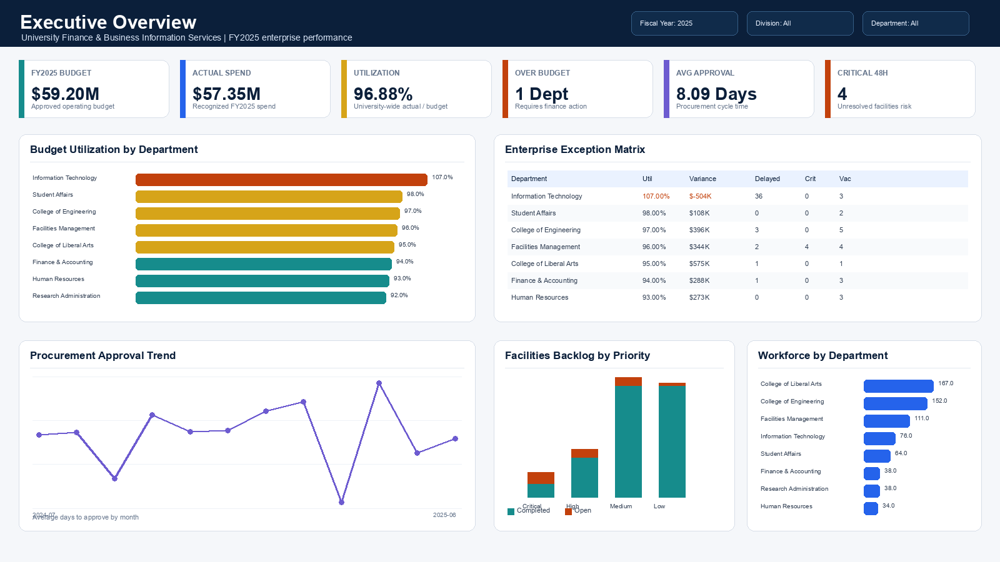
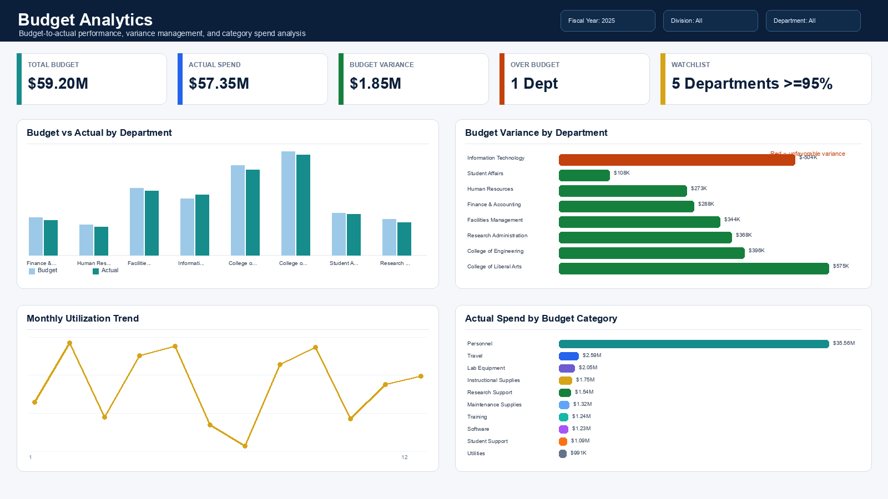
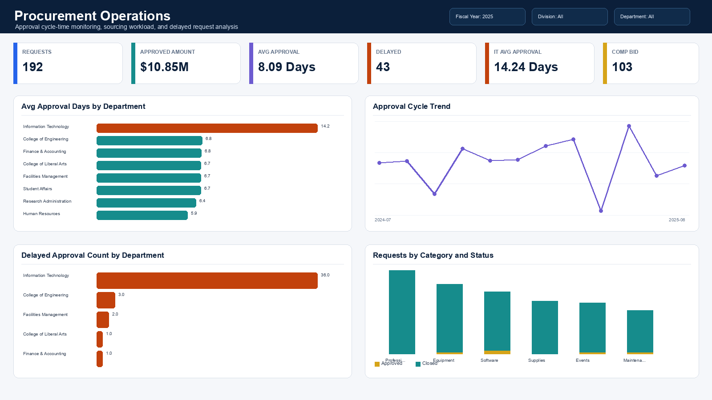
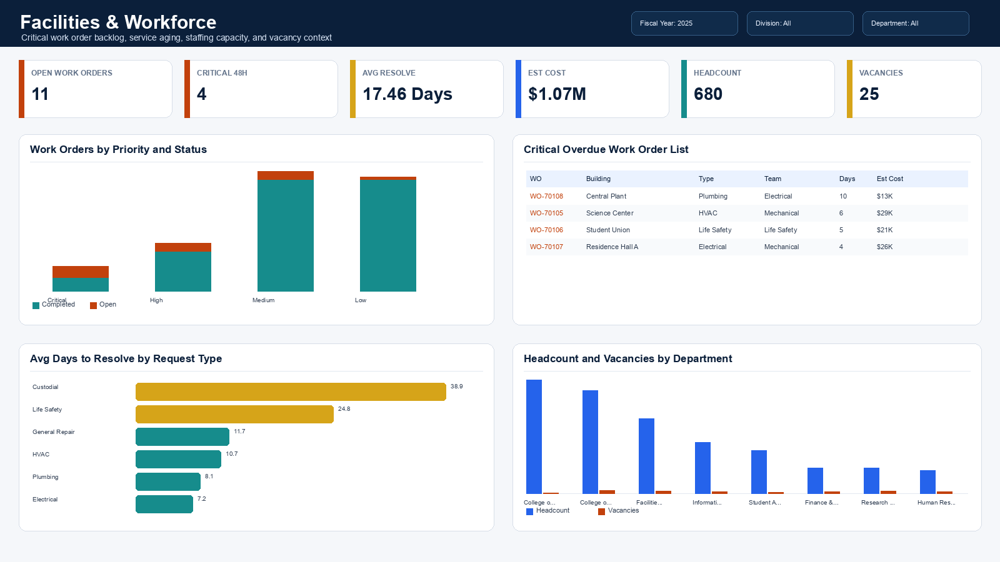

# Higher Education Enterprise Analytics & Decision Support Platform

## 1. Project Overview

This portfolio case study simulates a university Finance & Business Information Services analytics initiative. The project demonstrates how a Business Analyst, Business Systems Analyst, Reporting Analyst, or Institutional Analytics professional can translate fragmented administrative reporting into an integrated enterprise analytics solution.

The platform consolidates Finance, Procurement, Facilities, and HR reporting into a shared analytics model with:

- Business requirements and stakeholder analysis
- Current-state and future-state process documentation
- Python data generation and ETL pipeline
- Power BI-ready CSV datasets
- Enterprise data model and solution architecture
- Dashboard specifications and static dashboard mockups
- User acceptance testing package
- Executive summary reporting

The project is based on realistic synthetic university data for FY2024 and FY2025.

## 2. Business Problem

University administrative reporting is often siloed across separate systems and teams. Finance, Procurement, Facilities, and HR each maintain their own source data, reporting cadence, and definitions. This creates operational and executive reporting challenges:

- Finance leaders lack one trusted view of budget utilization, procurement cycle time, maintenance backlog, and workforce trends.
- Department managers rely on manual spreadsheets and email updates to understand budget status or procurement progress.
- Procurement delays are difficult to connect to budget pressure or department-level performance.
- Critical facilities backlog is not consistently surfaced as an executive risk.
- Workforce vacancies and salary expense are reviewed separately from operational service demand.

This project addresses the problem by creating a unified analytics layer that supports cross-functional decision-making for university administration.

## 3. Solution Architecture

The solution follows a layered enterprise analytics architecture:

```text
Source Systems
Finance / Procurement / Facilities / HR
        ↓
Python Data Pipeline
generate_data.py → transform_data.py → validate_data.py
        ↓
Analytics Data Layer
dim_department, dim_date, budget, procurement, maintenance, workforce facts
        ↓
Dashboard Layer
Executive Overview, Budget Analytics, Procurement Operations, Facilities & Workforce
        ↓
Business Users
CFO, Finance, Procurement, Facilities, HR, Department Managers
```

Supporting documentation:

- [Solution Architecture](docs/architecture/solution_architecture.md)
- [System Architecture](docs/architecture/system_architecture.md)
- [Data Model Design](docs/data-model/data_model_design.md)

## 4. Data Model

The reporting model uses a star-schema approach with conformed department and date dimensions.

Dimensions:

- `dim_department`
- `dim_date`

Fact tables:

- `budget_summary`
- `budget_monthly_dashboard`
- `procurement_dashboard`
- `maintenance_dashboard`
- `hr_workforce_dashboard`

The model supports shared filtering by department, division, department type, fiscal year, and fiscal period. This allows stakeholders to view budget, procurement, facilities, and workforce metrics through the same organizational and fiscal lens.

Key model documents:

- [Enterprise Data Model](docs/data-model/data_model.md)
- [Enterprise Data Model Design](docs/data-model/data_model_design.md)

## 5. Dashboard Suite

The dashboard suite is designed for a university finance division and institutional analytics audience. Static mockups are available in `screenshots/`.

### Executive Overview

Purpose: provide executive leadership with a consolidated view of financial and operational risk.

Primary content:

- FY2025 budget and actual spend
- Budget utilization
- Procurement approval cycle time
- Critical facilities backlog
- Enterprise exception matrix

Mockup:



### Budget Analytics

Purpose: support Finance and budget analysts with department-level budget-to-actual monitoring, variance analysis, and category spend review.

Primary content:

- Budget vs actual by department
- Budget variance by department
- Monthly utilization trend
- Actual spend by budget category

Mockup:



### Procurement Operations

Purpose: support Procurement and Finance reviewers with cycle-time monitoring, delayed approval review, and sourcing workload analysis.

Primary content:

- Average approval days by department
- Delayed approvals by department
- Requests by category and status
- IT procurement bottleneck visibility

Mockup:



### Facilities & Workforce

Purpose: connect facilities service risk with staffing capacity and workforce context.

Primary content:

- Work orders by priority and status
- Critical overdue work order list
- Average days to resolve by request type
- Headcount and vacancies by department

Mockup:



Dashboard documentation:

- [Power BI Dashboard Design](docs/reporting/powerbi_dashboard_design.md)

## 6. Key Business Insights

The generated dataset includes realistic findings that support business analysis and executive discussion.

| Insight | Evidence |
|---|---|
| IT exceeded FY2025 budget | Information Technology reached 107.00% budget utilization, approximately $504,000 over budget. |
| Student Affairs was near budget limit | Student Affairs reached 98.00% utilization, leaving approximately $108,000 remaining. |
| IT procurement approval cycle was elevated | IT approval cycle averaged 14.24 days versus an 8.09-day university average. |
| Procurement delays require operational review | The dataset includes 43 delayed procurement approvals. |
| Critical facilities backlog exists | Four critical unresolved maintenance requests were open more than 48 hours. |
| Workforce context supports operational analysis | Latest workforce data shows 680 headcount and 25 vacancies across the university. |

Recommended business actions:

- Establish recurring budget exception review for over-budget and near-threshold departments.
- Monitor procurement approval cycle time by department, category, approval level, and reviewer.
- Review IT procurement workflow for complexity, routing, or documentation bottlenecks.
- Escalate critical facilities work orders open longer than 48 hours.
- Review workforce vacancies alongside facilities backlog and service delays.

## 7. Business Analyst Deliverables

| Deliverable | File | Purpose |
|---|---|---|
| BRD | [business_requirements.md](docs/business-analysis/business_requirements.md) | Final business requirements package for the analytics platform. |
| Current State Analysis | [process_flow_current_state.md](docs/architecture/process_flow_current_state.md) | Documents the current procurement process and pain points. |
| Future State Analysis | [process_flow_future_state.md](docs/architecture/process_flow_future_state.md) | Defines the improved procurement process with tracking, alerts, and dashboard monitoring. |
| UAT Package | [user_acceptance_testing.md](docs/testing/user_acceptance_testing.md) | Enterprise UAT package with scenarios, test cases, and stakeholder signoff. |
| Dashboard Specifications | [powerbi_dashboard_design.md](docs/reporting/powerbi_dashboard_design.md) | Dashboard page design, KPIs, visuals, fields, and expected insights. |
| Project Story | [project_story.md](docs/business-analysis/project_story.md) | Hiring-manager narrative explaining the project end to end. |
| Executive Report | [executive_summary_report.md](docs/reporting/executive_summary_report.md) | Leadership-facing findings and recommendations. |
| Interview Guide | [interview_guide.md](docs/business-analysis/interview_guide.md) | Interview preparation and project talking points. |

## 8. Technical Deliverables

| Deliverable | File / Folder | Purpose |
|---|---|---|
| Data Model | [data_model_design.md](docs/data-model/data_model_design.md) | Defines dimensions, facts, grains, keys, relationships, and reporting use cases. |
| SQL Schema | [01_schema.sql](sql/01_schema.sql) | PostgreSQL-compatible star-schema warehouse design. |
| ETL Pipeline | [generate_data.py](src/generate_data.py), [transform_data.py](src/transform_data.py) | Generates synthetic source data and transforms it into dashboard-ready outputs. |
| Validation Framework | [validate_data.py](src/validate_data.py), [test_data_quality.py](tests/test_data_quality.py) | Validates data quality, calculations, and expected business scenarios. |
| Power BI CSV Outputs | `data/powerbi/` | Dashboard-ready datasets for Power BI Service. |
| Dashboard Mockup Generator | [generate_dashboard_mockups.py](src/generate_dashboard_mockups.py) | Generates static dashboard PNG mockups from the current CSV data. |

## 9. Project Structure

```text
higher-ed-analytics-platform/
├── README.md
├── requirements.txt
├── data/
│   ├── raw/
│   ├── processed/
│   └── powerbi/
├── docs/
│   ├── README.md
│   ├── business-analysis/
│   ├── architecture/
│   ├── data-model/
│   ├── reporting/
│   └── testing/
├── archive/
│   └── docs/
├── screenshots/
│   ├── executive_overview_mockup.png
│   ├── budget_analytics_mockup.png
│   ├── procurement_operations_mockup.png
│   └── facilities_workforce_mockup.png
├── sql/
│   ├── 01_schema.sql
│   ├── 02_indexes.sql
│   └── 03_sample_queries.sql
├── src/
│   ├── generate_data.py
│   ├── transform_data.py
│   ├── validate_data.py
│   └── generate_dashboard_mockups.py
└── tests/
    └── test_data_quality.py
```

## How to Run

Create a virtual environment and install dependencies:

```bash
python3 -m venv .venv
source .venv/bin/activate
pip install -r requirements.txt
```

Generate raw synthetic data:

```bash
python src/generate_data.py
```

Create Power BI-ready datasets:

```bash
python src/transform_data.py
```

Run validation:

```bash
python src/validate_data.py
pytest -q
```

Generate dashboard mockups:

```bash
python src/generate_dashboard_mockups.py
```

Expected validation result:

```text
All data validations passed.
6 passed
```
