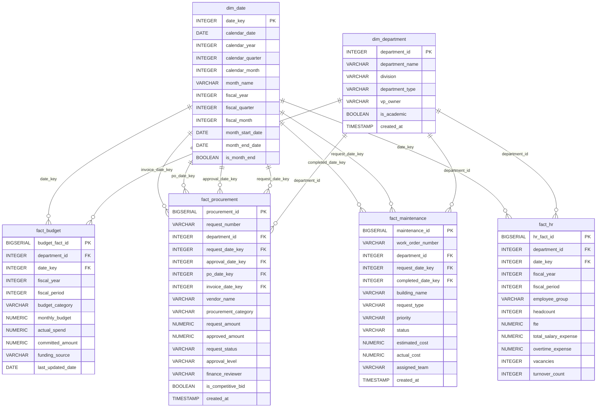

# Data Architecture

## Overview

The analytics platform uses a star-schema style warehouse design for integrated university administrative reporting. `dim_department` and `dim_date` are conformed dimensions shared across Finance, Procurement, Facilities, and HR fact tables. Each fact table keeps the grain of its business process while using common department and date keys for enterprise reporting.

This design supports Power BI dashboard development, cross-functional analysis, and consistent fiscal-year reporting across departments.

## Mermaid ER Diagram

## Relationship Summary

| Parent Table | Child Table | Relationship | Foreign Key |
|---|---|---|---|
| `dim_department` | `fact_budget` | One department to many budget records | `fact_budget.department_id` |
| `dim_department` | `fact_procurement` | One department to many procurement requests | `fact_procurement.department_id` |
| `dim_department` | `fact_maintenance` | One department to many maintenance requests | `fact_maintenance.department_id` |
| `dim_department` | `fact_hr` | One department to many monthly HR records | `fact_hr.department_id` |
| `dim_date` | `fact_budget` | One date to many budget records | `fact_budget.date_key` |
| `dim_date` | `fact_procurement` | One date to many procurement lifecycle dates | `request_date_key`, `approval_date_key`, `po_date_key`, `invoice_date_key` |
| `dim_date` | `fact_maintenance` | One date to many maintenance lifecycle dates | `request_date_key`, `completed_date_key` |
| `dim_date` | `fact_hr` | One date to many monthly HR records | `fact_hr.date_key` |

## Grain

| Table | Grain |
|---|---|
| `dim_department` | One row per university department. |
| `dim_date` | One row per calendar date. |
| `fact_budget` | One row per department, fiscal year, fiscal period, and budget category. |
| `fact_procurement` | One row per procurement request. |
| `fact_maintenance` | One row per facilities work order. |
| `fact_hr` | One row per department, fiscal year, fiscal period, and employee group. |

## Draw.io Compatible Diagram Description

Use this section to recreate the ER diagram in Draw.io or diagrams.net.

### Canvas Layout

Create an enterprise data warehouse layout with dimensions on the left and facts on the right:

- Place `dim_department` in the upper-left.
- Place `dim_date` in the lower-left.
- Place `fact_budget` in the upper-middle.
- Place `fact_procurement` in the upper-right.
- Place `fact_maintenance` in the lower-middle.
- Place `fact_hr` in the lower-right.

### Table Shapes

Use entity/table shapes with three visual sections:

1. Table name header.
2. Key fields.
3. Descriptive and measure fields.

Recommended styling:

- Dimension tables: blue header fill.
- Fact tables: dark gray or green header fill.
- Primary keys: bold text with `PK`.
- Foreign keys: italic text with `FK`.
- Measures: standard text.
- Use crow's foot connectors for one-to-many relationships.

### Entity Definitions

**dim_department**

- `department_id` PK
- `department_name`
- `division`
- `department_type`
- `vp_owner`
- `is_academic`
- `created_at`

**dim_date**

- `date_key` PK
- `calendar_date`
- `calendar_year`
- `calendar_quarter`
- `calendar_month`
- `month_name`
- `fiscal_year`
- `fiscal_quarter`
- `fiscal_month`
- `month_start_date`
- `month_end_date`
- `is_month_end`

**fact_budget**

- `budget_fact_id` PK
- `department_id` FK to `dim_department.department_id`
- `date_key` FK to `dim_date.date_key`
- `fiscal_year`
- `fiscal_period`
- `budget_category`
- `monthly_budget`
- `actual_spend`
- `committed_amount`
- `funding_source`
- `last_updated_date`

**fact_procurement**

- `procurement_id` PK
- `request_number`
- `department_id` FK to `dim_department.department_id`
- `request_date_key` FK to `dim_date.date_key`
- `approval_date_key` FK to `dim_date.date_key`
- `po_date_key` FK to `dim_date.date_key`
- `invoice_date_key` FK to `dim_date.date_key`
- `vendor_name`
- `procurement_category`
- `request_amount`
- `approved_amount`
- `request_status`
- `approval_level`
- `finance_reviewer`
- `is_competitive_bid`
- `created_at`

**fact_maintenance**

- `maintenance_id` PK
- `work_order_number`
- `department_id` FK to `dim_department.department_id`
- `request_date_key` FK to `dim_date.date_key`
- `completed_date_key` FK to `dim_date.date_key`
- `building_name`
- `request_type`
- `priority`
- `status`
- `estimated_cost`
- `actual_cost`
- `assigned_team`
- `created_at`

**fact_hr**

- `hr_fact_id` PK
- `department_id` FK to `dim_department.department_id`
- `date_key` FK to `dim_date.date_key`
- `fiscal_year`
- `fiscal_period`
- `employee_group`
- `headcount`
- `fte`
- `total_salary_expense`
- `overtime_expense`
- `vacancies`
- `turnover_count`

### Connectors

Draw the following one-to-many connectors:

- `dim_department.department_id` one-to-many `fact_budget.department_id`
- `dim_department.department_id` one-to-many `fact_procurement.department_id`
- `dim_department.department_id` one-to-many `fact_maintenance.department_id`
- `dim_department.department_id` one-to-many `fact_hr.department_id`
- `dim_date.date_key` one-to-many `fact_budget.date_key`
- `dim_date.date_key` one-to-many `fact_procurement.request_date_key`
- `dim_date.date_key` one-to-many `fact_procurement.approval_date_key`
- `dim_date.date_key` one-to-many `fact_procurement.po_date_key`
- `dim_date.date_key` one-to-many `fact_procurement.invoice_date_key`
- `dim_date.date_key` one-to-many `fact_maintenance.request_date_key`
- `dim_date.date_key` one-to-many `fact_maintenance.completed_date_key`
- `dim_date.date_key` one-to-many `fact_hr.date_key`

### Diagram Notes

- Label `dim_department` and `dim_date` as conformed dimensions.
- Label fact tables by business process: Finance, Procurement, Facilities, and HR.
- Use optional relationship notation for nullable lifecycle dates such as approval, PO, invoice, and completed dates.
- Add a note that dashboard-ready CSVs are generated from this warehouse model into `data/powerbi/`.
