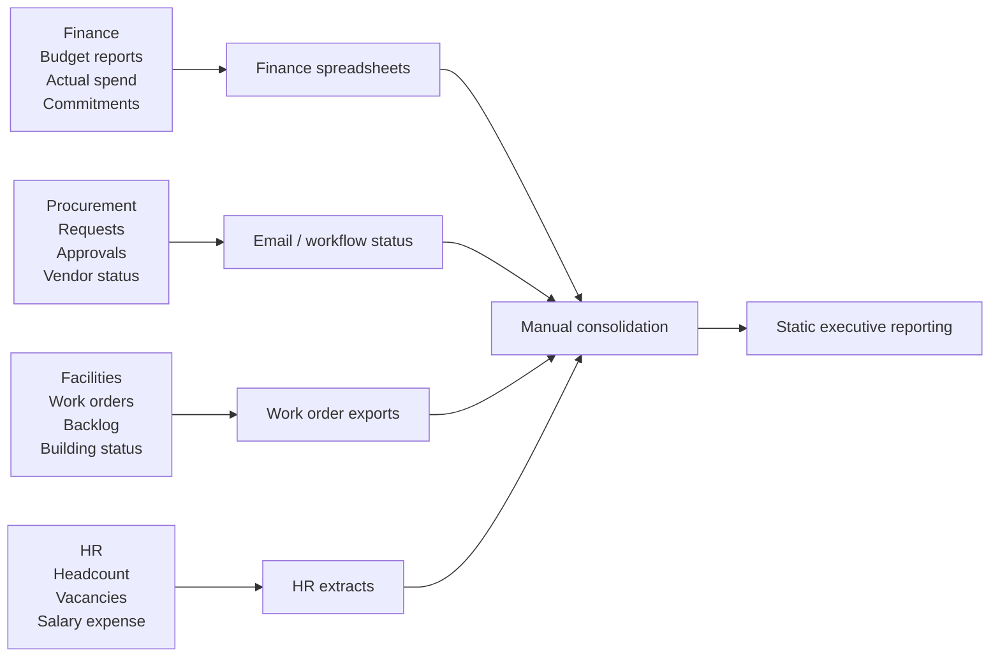
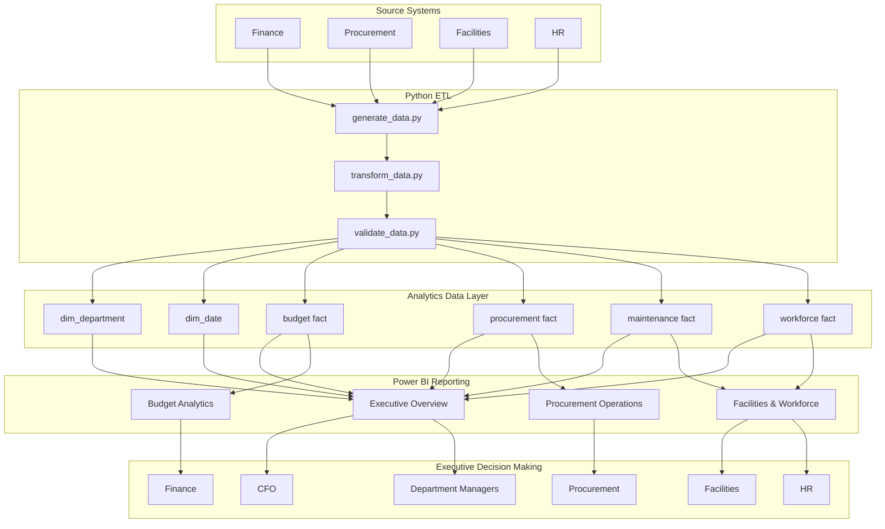

# Solution Architecture

## Higher Education Enterprise Analytics & Decision Support Platform

Prepared for: University Finance & Business Information Services  
Target audience: University Business Analyst, Institutional Analytics, Finance & Business Information Services

## 1. Architecture Purpose

This document describes the solution architecture for a university enterprise analytics platform that integrates Finance, Procurement, Facilities, and HR reporting into a shared decision-support environment.

The architecture is designed to show how siloed administrative reporting can be transformed into an integrated analytics workflow:

```text
Source Systems
        ↓
Python ETL
        ↓
Analytics Data Layer
        ↓
Power BI Reporting
        ↓
Executive Decision Making
```

The solution does not replace operational source systems. Instead, it creates a governed reporting layer that standardizes data, validates key calculations, and supports executive and departmental dashboards.

## 2. Current State Architecture

In the current state, each university administrative function reports separately. Finance, Procurement, Facilities, and HR maintain their own reporting processes, data extracts, definitions, and stakeholder communications.

```text
Finance Reporting       Procurement Reporting       Facilities Reporting       HR Reporting
        |                        |                          |                    |
        ↓                        ↓                          ↓                    ↓
Budget spreadsheets      Approval status emails       Work order exports        HR extracts
        |                        |                          |                    |
        +---------------- Manual consolidation and reconciliation ---------------+
                                      |
                                      ↓
                         Static executive reporting
```

### Current-State Characteristics

| Function | Reporting Pattern | Business Limitation |
|---|---|---|
| Finance | Budget and actual spend reports are reviewed separately from operational data. | Budget risk is not always connected to procurement, facilities, or workforce drivers. |
| Procurement | Request status and approval delays are tracked in workflows, email, or local reports. | Leadership cannot easily see approval bottlenecks by department or fiscal period. |
| Facilities | Work order backlog is tracked by priority, building, team, and status. | Critical backlog may not be elevated into executive financial reporting. |
| HR | Workforce data is maintained separately due to sensitivity and HR ownership. | Staffing context is not consistently available when reviewing operational performance. |

### Current-State Pain Points

- Data is siloed by business function.
- Reporting definitions are inconsistent across departments.
- Department managers rely on spreadsheets and email follow-up.
- Executive leaders receive static summaries rather than integrated exception reporting.
- Manual consolidation increases reporting effort, audit risk, and decision delay.

## 3. Current State Mermaid Diagram



## 4. Future State Architecture

The future state introduces a shared analytics pipeline and data layer between operational sources and Power BI reporting. The model uses Python ETL, conformed dimensions, curated fact tables, and dashboard-ready outputs.

```text
Source Systems
 ├ Finance
 ├ Procurement
 ├ Facilities
 └ HR

        ↓

Python ETL
 ├ generate_data.py
 ├ transform_data.py
 └ validate_data.py

        ↓

Analytics Data Layer
 ├ dim_department
 ├ dim_date
 ├ budget fact
 ├ procurement fact
 ├ maintenance fact
 └ workforce fact

        ↓

Power BI Reporting
 ├ Executive Overview
 ├ Budget Analytics
 ├ Procurement Operations
 └ Facilities & Workforce

        ↓

Executive Decision Making
 ├ CFO
 ├ Finance
 ├ Procurement
 ├ Facilities
 ├ HR
 └ Department Managers
```

## 5. Future State Mermaid Diagram



## 6. Architecture Components

| Layer | Component | Purpose |
|---|---|---|
| Source Systems | Finance | Budget, actual spend, commitments, fiscal periods, budget categories. |
| Source Systems | Procurement | Requests, vendors, approvals, PO dates, invoice dates, approval levels, request status. |
| Source Systems | Facilities | Work orders, buildings, request types, priorities, status, assigned teams, costs. |
| Source Systems | HR | Headcount, FTE, salary expense, overtime, vacancies, turnover. |
| Python ETL | `generate_data.py` | Generates realistic synthetic source data for the prototype model. |
| Python ETL | `transform_data.py` | Cleans, standardizes, and transforms data into Power BI-ready CSV outputs. |
| Python ETL | `validate_data.py` | Validates department IDs, dates, calculations, and business exception logic. |
| Analytics Data Layer | `dim_department` | Shared organizational dimension for department, division, department type, and academic flag. |
| Analytics Data Layer | `dim_date` | Shared date dimension for calendar and fiscal reporting. |
| Analytics Data Layer | Budget fact | Budget utilization, actual spend, commitments, and variance reporting. |
| Analytics Data Layer | Procurement fact | Approval cycle time, delayed approvals, category/status analysis, and vendor reporting. |
| Analytics Data Layer | Maintenance fact | Work order backlog, critical alerts, cost, and resolution time. |
| Analytics Data Layer | Workforce fact | Headcount, FTE, salary expense, vacancies, turnover, and staffing trends. |
| Power BI Reporting | Executive Overview | Cross-functional executive exception monitoring. |
| Power BI Reporting | Budget Analytics | Finance and department budget review. |
| Power BI Reporting | Procurement Operations | Procurement delay and sourcing workload analysis. |
| Power BI Reporting | Facilities & Workforce | Facilities backlog and workforce capacity reporting. |
| Business Users | CFO, Finance, Procurement, Facilities, HR, Department Managers | Decision-making, operational review, and performance management. |

## 7. Data Flow Description

### Step 1: Source System Inputs

Finance, Procurement, Facilities, and HR provide source data representing the major administrative processes of the university. In this prototype implementation, those source systems are simulated through synthetic CSV generation.

Examples:

- Finance provides budget, actual spend, commitments, funding source, and fiscal-period data.
- Procurement provides request lifecycle dates, vendors, categories, approval levels, and status.
- Facilities provides work orders, priorities, buildings, costs, assigned teams, and completion status.
- HR provides headcount, FTE, salary expense, vacancies, overtime, and turnover.

### Step 2: Python ETL

The Python pipeline standardizes and prepares the source data.

- `generate_data.py` creates realistic FY2024 and FY2025 source datasets.
- `transform_data.py` creates dashboard-ready outputs and calculated fields.
- `validate_data.py` confirms data integrity and expected business conditions.

Key calculated fields include:

- `budget_utilization_pct`
- `budget_variance`
- `days_to_approve`
- `days_to_complete`
- `days_to_resolve`
- `is_over_budget`
- `is_approval_delayed`
- `is_critical_over_48h`

### Step 3: Analytics Data Layer

The transformed data is organized into a star-schema style analytics layer. `dim_department` and `dim_date` serve as conformed dimensions, while budget, procurement, maintenance, and workforce facts support functional reporting.

This layer enables Power BI to apply shared filters across separate business domains.

### Step 4: Power BI Reporting

Power BI consumes the curated datasets and presents four dashboard pages:

- Executive Overview
- Budget Analytics
- Procurement Operations
- Facilities & Workforce

Each page supports a different business audience while using the same underlying department and date structures.

### Step 5: Executive Decision Making

The dashboard outputs support decisions such as:

- Which departments require budget intervention?
- Where are procurement approvals delayed?
- Which critical maintenance requests require escalation?
- Where do vacancies or workforce constraints affect operations?
- Which departments require executive follow-up?

## 8. Business Benefits

| Benefit | Description |
|---|---|
| Unified executive visibility | Leaders can review Finance, Procurement, Facilities, and HR exceptions in one reporting environment. |
| Reduced manual reporting | Standardized datasets reduce spreadsheet consolidation and repeated analyst preparation. |
| Earlier budget risk detection | Budget utilization and variance indicators identify over-budget and near-threshold departments earlier. |
| Procurement transparency | Approval cycle-time reporting highlights bottlenecks by department, category, approval level, and reviewer. |
| Facilities risk escalation | Critical work orders older than 48 hours can be surfaced as executive operational risks. |
| Workforce-informed decisions | Headcount, vacancies, and salary trends provide context for budget pressure and service delays. |
| Consistent metric definitions | Shared KPI logic improves stakeholder trust in reporting. |
| Scalable analytics foundation | Conformed dimensions and fact tables support future dashboards, drill-through pages, and production database integration. |

## 9. Consulting Summary

The proposed architecture moves the university from separate functional reporting toward integrated enterprise analytics. The key design principle is to preserve operational systems as sources of record while adding a governed analytics layer for decision support.

For University Business Analyst, Institutional Analytics, and Finance & Business Information Services audiences, this architecture demonstrates how requirements, data modeling, ETL, validation, and Power BI reporting work together to produce actionable executive insights.
