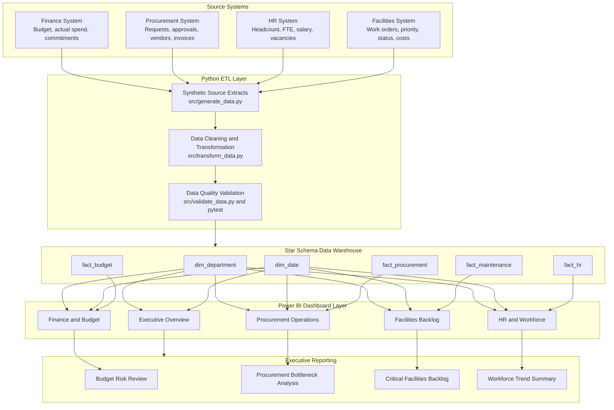

# System Architecture

## Overview

The platform follows a layered enterprise analytics architecture. Operational source systems provide domain-specific extracts for Finance, Procurement, HR, and Facilities. Python ETL scripts standardize, validate, and transform the data into a star-schema warehouse design. Curated dashboard-ready outputs are then consumed by Power BI for operational dashboards and executive reporting.

This architecture is intentionally simple enough for a prototype implementation while reflecting the control points used in real Finance & Business Information Services environments: source alignment, transformation logic, dimensional modeling, dashboard semantic design, and leadership reporting.

## Mermaid Diagram

## Architecture Layers

| Layer | Components | Purpose |
|---|---|---|
| Source Systems | Finance, Procurement, HR, Facilities | Represent siloed university operating systems and source extracts. |
| Python ETL | `generate_data.py`, `transform_data.py`, `validate_data.py`, pytest | Generate synthetic source data, standardize fields, create calculated metrics, and validate quality. |
| Star Schema Data Warehouse | `dim_department`, `dim_date`, `fact_budget`, `fact_procurement`, `fact_maintenance`, `fact_hr` | Provide a governed reporting model with conformed dimensions and process-specific fact tables. |
| Power BI Dashboard | Executive, Finance, Procurement, Facilities, HR pages | Deliver role-aware analytics and operational exception monitoring. |
| Executive Reporting | Budget risk, cycle-time bottlenecks, critical backlog, workforce trends | Translate dashboard outputs into leadership decisions and process improvement actions. |

## Data Flow

1. Source systems provide operational extracts for Finance, Procurement, HR, and Facilities.
2. Python ETL scripts generate, clean, standardize, and enrich the data.
3. Validation checks confirm required keys, dates, calculations, and expected business story metrics.
4. The curated model aligns facts to shared department and date dimensions.
5. Power BI consumes dashboard-ready CSV files from `data/powerbi/`.
6. Executive reporting summarizes risk, bottlenecks, backlog, and workforce trends for leadership action.

## Control Points

| Control Point | Implementation |
|---|---|
| Source traceability | Raw generated source files are retained in `data/raw/`. |
| Transformation transparency | Business logic is implemented in `src/transform_data.py`. |
| Data quality assurance | `src/validate_data.py` and `tests/test_data_quality.py` validate calculations and business rules. |
| Dimensional consistency | Department and date dimensions are reused across all fact tables. |
| Dashboard readiness | Curated CSV outputs are published to `data/powerbi/`. |
| Executive communication | Findings are summarized in `../reporting/executive_summary_report.md`. |

## Draw.io Compatible Diagram Description

Use this section to recreate the system architecture in Draw.io or diagrams.net.

### Canvas Layout

Create a left-to-right enterprise architecture flow with five vertical zones:

1. **Source Systems**
2. **Python ETL**
3. **Star Schema Data Warehouse**
4. **Power BI Dashboard**
5. **Executive Reporting**

Place each zone in a lightly shaded container with a bold title at the top.

### Zone 1: Source Systems

Container title: `Source Systems`

Create four system boxes stacked vertically:

- `Finance System`
  - Budget
  - Actual spend
  - Commitments
- `Procurement System`
  - Requests
  - Approvals
  - Vendors
  - Invoices
- `HR System`
  - Headcount
  - FTE
  - Salary
  - Vacancies
- `Facilities System`
  - Work orders
  - Priority
  - Status
  - Costs

Recommended shape: application or system rectangle.

### Zone 2: Python ETL

Container title: `Python ETL`

Create three process boxes:

- `Source Extract Generation`
  - `src/generate_data.py`
- `Cleaning and Transformation`
  - `src/transform_data.py`
- `Data Quality Validation`
  - `src/validate_data.py`
  - `tests/test_data_quality.py`

Connect the three boxes top-to-bottom or left-to-right inside the ETL zone.

### Zone 3: Star Schema Data Warehouse

Container title: `Star Schema Data Warehouse`

Create two dimension boxes at the top:

- `dim_department`
- `dim_date`

Create four fact boxes below:

- `fact_budget`
- `fact_procurement`
- `fact_maintenance`
- `fact_hr`

Use database table shapes. Show the warehouse as a governed reporting layer, not as a direct operational source.

### Zone 4: Power BI Dashboard

Container title: `Power BI Dashboard`

Create five dashboard page boxes:

- `Executive Overview`
- `Finance and Budget`
- `Procurement Operations`
- `Facilities Backlog`
- `HR and Workforce`

Recommended shape: screen or dashboard rectangle.

### Zone 5: Executive Reporting

Container title: `Executive Reporting`

Create four report output boxes:

- `Budget Risk Review`
- `Procurement Bottleneck Analysis`
- `Critical Facilities Backlog`
- `Workforce Trend Summary`

Recommended shape: document or report rectangle.

### Connectors

Draw arrows in this sequence:

- Each source system points to `Source Extract Generation`.
- `Source Extract Generation` points to `Cleaning and Transformation`.
- `Cleaning and Transformation` points to `Data Quality Validation`.
- `Data Quality Validation` points to the `Star Schema Data Warehouse` container.
- Warehouse tables point to Power BI dashboard pages.
- Dashboard pages point to the executive reporting outputs.

Use solid arrows for data movement and dashed arrows for reporting consumption if you want to distinguish physical data flow from business consumption.

### Styling Guidance

- Source systems: light gray fill.
- ETL layer: blue fill.
- Data warehouse: green fill.
- Power BI dashboard: yellow or gold fill.
- Executive reporting: dark blue header with white text.
- Add a small note under the warehouse: `Conformed dimensions support cross-functional reporting by department and fiscal period.`
- Add a small note under validation: `Automated checks verify keys, dates, calculations, and modeled business findings.`
