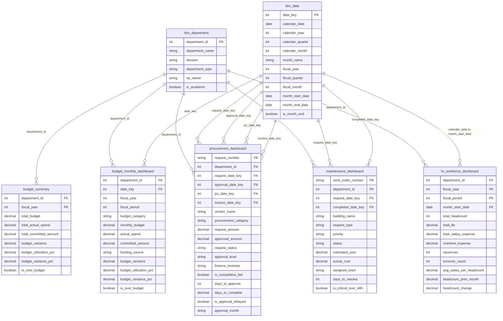

# Enterprise Data Model

## Purpose

This document defines the enterprise reporting data model for the Higher Education Enterprise Analytics & Decision Support Platform. It is based on the dashboard-ready CSV files in `data/powerbi/` and is written for a Business Analyst / Data Analyst portfolio audience.

The model integrates Finance, Procurement, Facilities, and HR reporting into a shared Power BI semantic model using conformed department and date dimensions.

## Dataset Inventory

| Dataset | Model Role | Grain | Row Count |
|---|---|---|---:|
| `dim_department.csv` | Dimension | One row per university department | 8 |
| `dim_date.csv` | Dimension | One row per calendar date | 731 |
| `budget_summary.csv` | Fact / aggregate fact | One row per department and fiscal year | 16 |
| `budget_monthly_dashboard.csv` | Fact | One row per department, fiscal period, and budget category | 768 |
| `procurement_dashboard.csv` | Fact | One row per procurement request | 192 |
| `maintenance_dashboard.csv` | Fact | One row per facilities work order | 108 |
| `hr_workforce_dashboard.csv` | Fact | One row per department and fiscal period | 192 |

## Dimension Tables

### `dim_department`

Business purpose: conformed department dimension used across Finance, Procurement, Facilities, and HR reporting.

Primary key:

- `department_id`

Attributes:

- `department_name`
- `division`
- `department_type`
- `vp_owner`
- `is_academic`

Power BI use:

- Shared slicer for department, division, department type, and academic/administrative reporting.
- Enables department-level filtering across every dashboard page.
- Supports role-based access design for department manager views.

### `dim_date`

Business purpose: conformed date dimension for calendar and fiscal reporting.

Primary key:

- `date_key`

Attributes:

- `calendar_date`
- `calendar_year`
- `calendar_quarter`
- `calendar_month`
- `month_name`
- `fiscal_year`
- `fiscal_quarter`
- `fiscal_month`
- `month_start_date`
- `month_end_date`
- `is_month_end`

Power BI use:

- Fiscal year, fiscal quarter, and fiscal month slicers.
- Time-series reporting for monthly budget, procurement approval trends, work order aging, and workforce trends.
- Role-playing date support for procurement and maintenance lifecycle dates.

## Fact Tables

### `budget_summary`

Business purpose: annual budget-to-actual summary by department and fiscal year.

Recommended primary key:

- Composite key: `department_id` + `fiscal_year`

Foreign keys:

- `department_id` references `dim_department.department_id`
- `fiscal_year` can be filtered through fiscal year slicers. Because this aggregate table does not include `date_key`, it should either use a fiscal-year slicer directly or a small fiscal-year bridge table in a production semantic model.

Measures and fields:

- `total_budget`
- `total_actual_spend`
- `total_committed_amount`
- `budget_variance`
- `budget_utilization_pct`
- `budget_variance_pct`
- `is_over_budget`

### `budget_monthly_dashboard`

Business purpose: monthly budget, actual spend, commitment, variance, and category analysis.

Recommended primary key:

- Composite key: `department_id` + `date_key` + `budget_category`

Foreign keys:

- `department_id` references `dim_department.department_id`
- `date_key` references `dim_date.date_key`

Measures and fields:

- `monthly_budget`
- `actual_spend`
- `committed_amount`
- `budget_variance`
- `budget_utilization_pct`
- `budget_variance_pct`
- `is_over_budget`
- `budget_category`
- `funding_source`

### `procurement_dashboard`

Business purpose: procurement request lifecycle reporting, including approval cycle time, vendor/category analysis, and delayed approval monitoring.

Recommended primary key:

- `request_number`

Foreign keys:

- `department_id` references `dim_department.department_id`
- `request_date_key` references `dim_date.date_key`
- `approval_date_key` references `dim_date.date_key`
- `po_date_key` references `dim_date.date_key`
- `invoice_date_key` references `dim_date.date_key`

Measures and fields:

- `request_amount`
- `approved_amount`
- `days_to_approve`
- `days_to_complete`
- `is_approval_delayed`
- `is_competitive_bid`
- `vendor_name`
- `procurement_category`
- `request_status`
- `approval_level`
- `finance_reviewer`
- `approval_month`

Power BI note:

- In a simple portfolio model, use `approval_month` directly for trend visuals.
- In a production semantic model, use role-playing date relationships for request date, approval date, PO date, and invoice date.

### `maintenance_dashboard`

Business purpose: facilities work order backlog, critical request monitoring, service aging, and cost reporting.

Recommended primary key:

- `work_order_number`

Foreign keys:

- `department_id` references `dim_department.department_id`
- `request_date_key` references `dim_date.date_key`
- `completed_date_key` references `dim_date.date_key`

Measures and fields:

- `estimated_cost`
- `actual_cost`
- `days_to_resolve`
- `is_critical_over_48h`
- `building_name`
- `request_type`
- `priority`
- `status`
- `assigned_team`

Power BI note:

- `completed_date_key` is nullable because open work orders do not have completion dates.
- Open work order aging uses `days_to_resolve`, which is calculated against the reporting snapshot date for unresolved requests.

### `hr_workforce_dashboard`

Business purpose: monthly workforce trends by department, including headcount, FTE, salary expense, overtime, vacancies, and turnover.

Recommended primary key:

- Composite key: `department_id` + `fiscal_year` + `fiscal_period`

Foreign keys:

- `department_id` references `dim_department.department_id`
- Recommended semantic-model relationship to `dim_date` through a derived month-start date key or a calculated `date_key` based on `month_start_date`.

Measures and fields:

- `total_headcount`
- `total_fte`
- `total_salary_expense`
- `overtime_expense`
- `vacancies`
- `turnover_count`
- `avg_salary_per_headcount`
- `headcount_prior_month`
- `headcount_change`
- `month_start_date`

Power BI note:

- The CSV does not currently include `date_key`; for a production Power BI model, add a calculated key from `month_start_date` or relate `month_start_date` to `dim_date.calendar_date`.

## Relationship Matrix

| From Table | From Field | To Table | To Field | Cardinality | Active in Power BI? | Purpose |
|---|---|---|---|---|---|---|
| `dim_department` | `department_id` | `budget_summary` | `department_id` | One-to-many | Yes | Department budget summary filtering. |
| `dim_department` | `department_id` | `budget_monthly_dashboard` | `department_id` | One-to-many | Yes | Monthly budget category filtering. |
| `dim_department` | `department_id` | `procurement_dashboard` | `department_id` | One-to-many | Yes | Procurement performance by department. |
| `dim_department` | `department_id` | `maintenance_dashboard` | `department_id` | One-to-many | Yes | Facilities backlog by department. |
| `dim_department` | `department_id` | `hr_workforce_dashboard` | `department_id` | One-to-many | Yes | Workforce trends by department. |
| `dim_date` | `date_key` | `budget_monthly_dashboard` | `date_key` | One-to-many | Yes | Fiscal period budget trends. |
| `dim_date` | `date_key` | `procurement_dashboard` | `request_date_key` | One-to-many | Optional role-playing | Request intake trend. |
| `dim_date` | `date_key` | `procurement_dashboard` | `approval_date_key` | One-to-many | Optional role-playing | Approval cycle trend. |
| `dim_date` | `date_key` | `procurement_dashboard` | `po_date_key` | One-to-many | Optional role-playing | Purchase order timing. |
| `dim_date` | `date_key` | `procurement_dashboard` | `invoice_date_key` | One-to-many | Optional role-playing | Invoice completion timing. |
| `dim_date` | `date_key` | `maintenance_dashboard` | `request_date_key` | One-to-many | Optional role-playing | Work order request trend. |
| `dim_date` | `date_key` | `maintenance_dashboard` | `completed_date_key` | One-to-many | Optional role-playing | Work order completion trend. |
| `dim_date` | `calendar_date` | `hr_workforce_dashboard` | `month_start_date` | One-to-many | Recommended | HR monthly trend filtering. |

## Mermaid ER Diagram

## Star Schema Explanation

The model follows a star-schema pattern with two conformed dimensions:

- `dim_department`
- `dim_date`

These dimensions connect to multiple fact tables:

- Finance facts: `budget_summary`, `budget_monthly_dashboard`
- Procurement fact: `procurement_dashboard`
- Facilities fact: `maintenance_dashboard`
- HR fact: `hr_workforce_dashboard`

This design supports cross-functional reporting because every operating area can be filtered by department and, where appropriate, by fiscal period. For example, a Finance leader can select Information Technology and see budget utilization, procurement approval delays, facilities requests, and workforce metrics in the same report experience.

### Why This Is a Star Schema

- Facts contain measurable business events or periodic snapshots.
- Dimensions contain descriptive context used for filtering and grouping.
- Department and date are shared across multiple subject areas.
- The model avoids many-to-many relationships between operational fact tables.
- Power BI visuals can aggregate each fact table independently while sharing slicers from conformed dimensions.

### Aggregate and Detail Facts

The model includes both summary and detail-level facts:

- `budget_summary` is an aggregate annual fact used for executive KPIs.
- `budget_monthly_dashboard` is a monthly detail fact used for trends and category analysis.
- `procurement_dashboard`, `maintenance_dashboard`, and `hr_workforce_dashboard` support operational analysis at request, work order, and monthly workforce grains.

In Power BI, avoid directly relating fact tables to each other. Shared slicing should flow from `dim_department` and `dim_date`.

## Power BI Dashboard Usage

### Executive Overview

Power BI uses the model to combine high-level measures from several fact tables:

- Budget performance from `budget_summary`
- Approval cycle time from `procurement_dashboard`
- Critical facilities backlog from `maintenance_dashboard`
- Current headcount and vacancies from `hr_workforce_dashboard`

Primary dimension use:

- `dim_department` enables department, division, and department type slicers.
- `dim_date` supports fiscal-year and time-period filtering where date keys are available.

Example insights supported:

- IT is over budget at 107.00% utilization.
- Student Affairs is near the budget limit at 98.00% utilization.
- IT procurement approvals average 14.24 days compared with an 8.09-day university average.
- Four critical maintenance requests are unresolved for more than 48 hours.

### Budget Analytics

Power BI uses:

- `budget_summary` for annual KPI cards and department-level budget-to-actual comparisons.
- `budget_monthly_dashboard` for monthly trend, budget category, commitment, and funding source analysis.
- `dim_department` for division and department filters.
- `dim_date` for fiscal period and fiscal quarter filters through `date_key`.

Recommended visuals:

- Budget vs actual by department.
- Budget variance waterfall.
- Monthly utilization trend.
- Actual spend by budget category.
- Budget exception table.

### Procurement Operations

Power BI uses:

- `procurement_dashboard` for request-level cycle time and sourcing analysis.
- `dim_department` for department and division filtering.
- `dim_date` as an optional role-playing date dimension for request, approval, PO, and invoice dates.

Recommended visuals:

- Average approval days by department.
- Delayed approval count by department.
- Approval cycle trend.
- Requests by category and status.
- Vendor spend and request detail.

Analyst note:

- For a simple web-based Power BI portfolio build, `approval_month` can be used directly for approval cycle trends.
- For an enterprise semantic model, create inactive date relationships for each lifecycle date and activate them in measures with `USERELATIONSHIP`.

### Facilities & Workforce

Power BI uses:

- `maintenance_dashboard` for work order backlog, priority, status, building, team, cost, and resolution metrics.
- `hr_workforce_dashboard` for headcount, FTE, salary expense, vacancies, turnover, and headcount change.
- `dim_department` to align Facilities and HR metrics by department.
- `dim_date` for trend filtering through request/completion dates and HR month start dates.

Recommended visuals:

- Work orders by priority and status.
- Critical overdue work order list.
- Average days to resolve by request type.
- Maintenance cost by building.
- Headcount and vacancies by department.
- Salary expense trend.

Business value:

- This page connects operational service risk with staffing capacity, which helps Finance and administrative leaders decide whether issues are caused by workload, staffing, vendor delays, or budget constraints.

## Recommended Power BI Implementation Notes

1. Load each CSV as a separate table.
2. Confirm data types:
   - Date fields as dates.
   - Currency fields as decimal numbers.
   - Boolean flags as true/false.
   - IDs and keys as whole numbers or text as appropriate.
3. Create one-to-many relationships from `dim_department` to all fact tables.
4. Create the active date relationship from `dim_date.date_key` to `budget_monthly_dashboard.date_key`.
5. For HR, relate `dim_date.calendar_date` to `hr_workforce_dashboard.month_start_date`, or add a calculated date key to HR.
6. For Procurement and Maintenance lifecycle dates, use role-playing date relationships or direct date fields depending on report complexity.
7. Keep filters flowing from dimensions to facts, not between fact tables.
8. Use measures for KPIs rather than raw column aggregation where possible.

## Business Analyst Portfolio Framing

This data model demonstrates several analyst capabilities:

- Translating siloed operational reporting into an integrated enterprise model.
- Identifying fact and dimension tables.
- Defining grain, keys, and relationships.
- Designing conformed dimensions for cross-functional reporting.
- Supporting multiple dashboard pages from a shared semantic layer.
- Explaining data-model tradeoffs in business terms for stakeholders.
