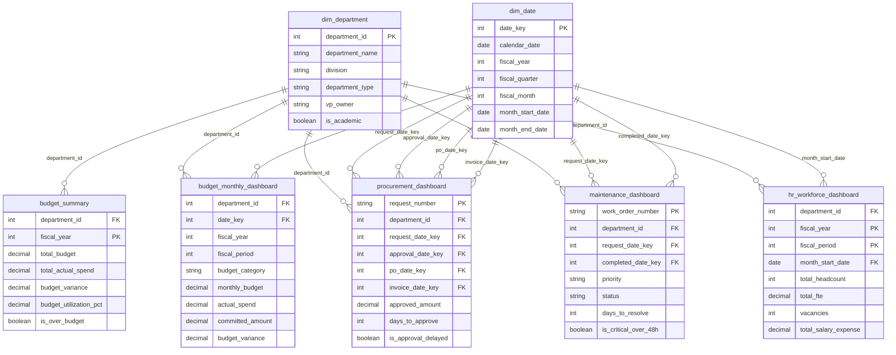

# Enterprise Data Model Package

## Higher Education Enterprise Analytics & Decision Support Platform

Prepared for: University Finance & Business Information Services  
Document type: Enterprise data model package  
Audience: University Business Analyst, Business Systems Analyst, Reporting Analyst, Institutional Analytics, Finance leadership

## 1. Business Overview

The Higher Education Enterprise Analytics Platform provides an integrated reporting model for university administrative operations. The model addresses a common higher education challenge: Finance, Procurement, Facilities, and HR data often live in separate systems, but executive leaders need a consolidated view of budget risk, procurement delays, facilities backlog, and workforce capacity.

The business objective of the data model is to create a governed analytics layer that supports:

- Budget utilization and variance reporting.
- Procurement approval cycle-time analysis.
- Facilities backlog and critical maintenance monitoring.
- Workforce headcount, FTE, vacancy, and salary expense reporting.
- Executive dashboards and department-level drilldown.

The model is designed for Power BI reporting and portfolio demonstration. It uses realistic synthetic data to simulate enterprise reporting scenarios in a university Finance & Business Information Services environment.

## 2. Data Model Overview

The data model follows a star-schema pattern. Shared dimensions provide consistent filtering and grouping, while fact tables store measurable business activity.

Dimensions:

- `dim_department`
- `dim_date`

Fact tables:

- `budget_summary`
- `budget_monthly_dashboard`
- `procurement_dashboard`
- `maintenance_dashboard`
- `hr_workforce_dashboard`

Design principles:

- Department and date are treated as conformed dimensions.
- Fact tables are not directly related to each other.
- Shared filters flow from dimensions to facts.
- Each fact table preserves the grain of its business process.
- Aggregated and detailed budget facts are both retained to support executive and analyst use cases.

## 3. Fact Tables

### `budget_summary`

| Element | Definition |
|---|---|
| Business purpose | Provides annual budget-to-actual performance by department and fiscal year. |
| Grain | One row per department and fiscal year. |
| Primary key | Composite key: `department_id` + `fiscal_year` |
| Foreign keys | `department_id` references `dim_department.department_id` |
| Measures | `total_budget`, `total_actual_spend`, `total_committed_amount`, `budget_variance`, `budget_utilization_pct`, `budget_variance_pct` |
| Important attributes | `department_name`, `fiscal_year`, `is_over_budget` |
| Reporting uses | Executive KPI cards, over-budget department count, annual budget utilization by department, department watchlist reporting |

Business notes:

- This is an aggregate fact table optimized for executive and annual Finance reporting.
- It supports the FY2025 finding that Information Technology is over budget at 107% utilization and Student Affairs is near threshold at 98%.
- Because it does not include `date_key`, fiscal-year filtering should use `fiscal_year` directly or a fiscal-year bridge in a production model.

### `budget_monthly_dashboard`

| Element | Definition |
|---|---|
| Business purpose | Provides monthly budget, actual spend, commitment, variance, and category-level analysis. |
| Grain | One row per department, fiscal period, and budget category. |
| Primary key | Composite key: `department_id` + `date_key` + `budget_category` |
| Foreign keys | `department_id` references `dim_department.department_id`; `date_key` references `dim_date.date_key` |
| Measures | `monthly_budget`, `actual_spend`, `committed_amount`, `budget_variance`, `budget_utilization_pct`, `budget_variance_pct` |
| Important attributes | `department_name`, `fiscal_year`, `fiscal_period`, `budget_category`, `funding_source`, `last_updated_date`, `is_over_budget` |
| Reporting uses | Monthly utilization trend, category spend analysis, fiscal-period variance review, commitment monitoring |

Business notes:

- This fact table supports Finance analyst drilldown beyond executive-level budget summaries.
- It allows budget pressure to be reviewed by period and category, helping distinguish recurring cost pressure from timing-related variance.

### `procurement_dashboard`

| Element | Definition |
|---|---|
| Business purpose | Provides procurement request lifecycle reporting, including approval cycle time, delay flags, vendor/category analysis, and sourcing workload. |
| Grain | One row per procurement request. |
| Primary key | `request_number` |
| Foreign keys | `department_id` references `dim_department.department_id`; `request_date_key`, `approval_date_key`, `po_date_key`, and `invoice_date_key` reference `dim_date.date_key` |
| Measures | `request_amount`, `approved_amount`, `days_to_approve`, `days_to_complete`, delayed approval count, competitive bid count |
| Important attributes | `department_name`, `vendor_name`, `procurement_category`, `request_status`, `approval_level`, `finance_reviewer`, `is_competitive_bid`, `is_approval_delayed`, `approval_month` |
| Reporting uses | Average approval days by department, delayed approvals by department, approval cycle trend, request volume by category/status, vendor spend review |

Business notes:

- The table supports the key project insight that IT procurement approvals average 14.24 days versus an 8.09-day university average.
- The table contains multiple lifecycle date keys. In Power BI, these should be treated as role-playing date relationships in a mature semantic model.

### `maintenance_dashboard`

| Element | Definition |
|---|---|
| Business purpose | Provides facilities work order backlog, service aging, critical request monitoring, and maintenance cost reporting. |
| Grain | One row per facilities work order. |
| Primary key | `work_order_number` |
| Foreign keys | `department_id` references `dim_department.department_id`; `request_date_key` and `completed_date_key` reference `dim_date.date_key` |
| Measures | `estimated_cost`, `actual_cost`, `days_to_resolve`, open work order count, critical overdue count |
| Important attributes | `department_name`, `request_date`, `completed_date`, `building_name`, `request_type`, `priority`, `status`, `assigned_team`, `is_critical_over_48h` |
| Reporting uses | Facilities backlog by department, work orders by priority/status, critical overdue list, days to resolve by request type, maintenance cost by building |

Business notes:

- `completed_date_key` is nullable because open work orders do not have completion dates.
- `days_to_resolve` uses a reporting snapshot for unresolved requests, which supports aging and backlog analysis.
- The table supports the key project insight that four critical maintenance requests are unresolved for more than 48 hours.

### `hr_workforce_dashboard`

| Element | Definition |
|---|---|
| Business purpose | Provides monthly workforce reporting by department, including staffing capacity, salary expense, vacancies, turnover, and headcount changes. |
| Grain | One row per department and fiscal period. |
| Primary key | Composite key: `department_id` + `fiscal_year` + `fiscal_period` |
| Foreign keys | `department_id` references `dim_department.department_id`; recommended relationship from `month_start_date` to `dim_date.calendar_date` or a derived `date_key` |
| Measures | `total_headcount`, `total_fte`, `total_salary_expense`, `overtime_expense`, `vacancies`, `turnover_count`, `avg_salary_per_headcount`, `headcount_change` |
| Important attributes | `department_name`, `fiscal_year`, `fiscal_period`, `month_start_date` |
| Reporting uses | Workforce vacancies by division, headcount trend by department, salary expense trend, staffing context for facilities backlog and budget pressure |

Business notes:

- HR salary expense is sensitive and should be protected through role-based access in a production reporting environment.
- The table supports the generated insight that the latest workforce snapshot includes 680 headcount and 25 vacancies.

## 4. Dimension Tables

### `dim_department`

| Element | Definition |
|---|---|
| Business purpose | Provides the shared organizational structure for Finance, Procurement, Facilities, and HR reporting. |
| Grain | One row per university department. |
| Primary key | `department_id` |
| Foreign keys | None |
| Important attributes | `department_name`, `division`, `department_type`, `vp_owner`, `is_academic` |
| Reporting uses | Department slicers, division rollups, academic/administrative comparisons, role-based department filtering |

Why it matters:

- It allows all business domains to use one department definition.
- It supports department-level accountability and executive rollups.
- It prevents inconsistent department naming across dashboards.

### `dim_date`

| Element | Definition |
|---|---|
| Business purpose | Provides a shared calendar and fiscal reporting structure. |
| Grain | One row per calendar date. |
| Primary key | `date_key` |
| Foreign keys | None |
| Important attributes | `calendar_date`, `calendar_year`, `calendar_quarter`, `calendar_month`, `month_name`, `fiscal_year`, `fiscal_quarter`, `fiscal_month`, `month_start_date`, `month_end_date`, `is_month_end` |
| Reporting uses | Fiscal-year filters, fiscal-period trends, procurement lifecycle analysis, work order aging, workforce trend reporting |

Why it matters:

- It aligns operational activity to the university fiscal calendar.
- It enables consistent fiscal-year and fiscal-period analysis.
- It supports role-playing date logic for procurement and maintenance lifecycle events.

## 5. Star Schema Diagram

## 6. Power BI Relationship Design

Recommended semantic model relationships:

| From Table | From Field | To Table | To Field | Cardinality | Active Relationship |
|---|---|---|---|---|---|
| `dim_department` | `department_id` | `budget_summary` | `department_id` | One-to-many | Yes |
| `dim_department` | `department_id` | `budget_monthly_dashboard` | `department_id` | One-to-many | Yes |
| `dim_department` | `department_id` | `procurement_dashboard` | `department_id` | One-to-many | Yes |
| `dim_department` | `department_id` | `maintenance_dashboard` | `department_id` | One-to-many | Yes |
| `dim_department` | `department_id` | `hr_workforce_dashboard` | `department_id` | One-to-many | Yes |
| `dim_date` | `date_key` | `budget_monthly_dashboard` | `date_key` | One-to-many | Yes |
| `dim_date` | `date_key` | `procurement_dashboard` | `request_date_key` | One-to-many | Optional role-playing |
| `dim_date` | `date_key` | `procurement_dashboard` | `approval_date_key` | One-to-many | Optional role-playing |
| `dim_date` | `date_key` | `procurement_dashboard` | `po_date_key` | One-to-many | Optional role-playing |
| `dim_date` | `date_key` | `procurement_dashboard` | `invoice_date_key` | One-to-many | Optional role-playing |
| `dim_date` | `date_key` | `maintenance_dashboard` | `request_date_key` | One-to-many | Optional role-playing |
| `dim_date` | `date_key` | `maintenance_dashboard` | `completed_date_key` | One-to-many | Optional role-playing |
| `dim_date` | `calendar_date` | `hr_workforce_dashboard` | `month_start_date` | One-to-many | Recommended |

Power BI design guidance:

- Use single-direction filtering from dimensions to fact tables.
- Avoid fact-to-fact relationships.
- Use `dim_department` for shared department, division, department type, VP owner, and academic flag slicers.
- Use `dim_date` for fiscal-year, fiscal-quarter, and fiscal-month slicers.
- Use role-playing date relationships for procurement and maintenance lifecycle dates in a production model.
- For a simplified Power BI Service portfolio build, direct fields such as `approval_month`, `fiscal_year`, and `month_start_date` can be used in visuals.

## 7. Reporting Use Cases

| Use Case | Business Question | Tables Used | Reporting Output |
|---|---|---|---|
| Budget utilization by department | Which departments are over budget or near budget thresholds? | `budget_summary`, `dim_department` | Budget utilization bar chart, over-budget count, watchlist departments |
| Monthly budget trend | Is spending pressure recurring or timing-related? | `budget_monthly_dashboard`, `dim_date`, `dim_department` | Monthly utilization trend and budget category analysis |
| Procurement delays by fiscal period | Which departments or fiscal periods have procurement bottlenecks? | `procurement_dashboard`, `dim_department`, `dim_date` | Average approval days by department and approval cycle trend |
| Procurement workload by category | Which categories drive request volume and sourcing workload? | `procurement_dashboard` | Requests by category and status |
| Facilities backlog by department | Which departments or buildings have unresolved work orders? | `maintenance_dashboard`, `dim_department` | Work order backlog by priority, status, building, and team |
| Critical maintenance escalation | Which critical requests have been open longer than 48 hours? | `maintenance_dashboard` | Critical overdue work order list |
| Workforce vacancies by division | Where are staffing gaps concentrated? | `hr_workforce_dashboard`, `dim_department` | Vacancy count by division and department |
| Workforce context for operations | Are service delays related to staffing capacity? | `maintenance_dashboard`, `hr_workforce_dashboard`, `dim_department` | Facilities backlog reviewed alongside headcount and vacancies |

## 8. Data Governance Considerations

| Governance Area | Consideration |
|---|---|
| Data ownership | Finance owns budget metrics; Procurement owns request lifecycle data; Facilities owns work order data; HR owns workforce data; Business Information Services owns the reporting model. |
| Metric definitions | KPI definitions should be documented and approved, especially budget utilization, delayed approvals, critical over-48-hour alerts, and vacancy counts. |
| Data quality | Validation checks should confirm department IDs, valid dates, calculation accuracy, and expected exception logic. |
| Security | HR salary expense and cross-department financial details should be restricted to approved roles. |
| Role-based access | Department managers should see their own department; Finance and executive users may require cross-department access. |
| Auditability | Transformation logic should be traceable to source scripts and documented calculations. |
| Refresh management | Production implementation should include scheduled refresh, failure alerts, and validation reporting. |
| Master data consistency | `dim_department` should be maintained as the authoritative reporting department list. |
| Fiscal calendar governance | `dim_date` should reflect the official university fiscal calendar. |

## Consulting Summary

This enterprise data model package provides a structured foundation for university administrative analytics. It translates business requirements into a dimensional model that supports executive reporting, Finance analysis, procurement operations, facilities backlog review, and workforce planning.

The central design strength is the use of conformed department and date dimensions. These shared dimensions allow separate business processes to be analyzed through a consistent organizational and fiscal reporting lens, which is essential for institutional analytics and Finance & Business Information Services reporting.
