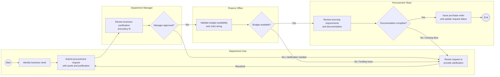

# Procurement Swimlane BPMN Diagram

## Purpose

This diagram converts the procurement process into a BPMN-style swimlane view for four core actors:

- Department User
- Department Manager
- Finance Office
- Procurement Team

The diagram is intended for business process analysis, stakeholder walkthroughs, and inclusion in a university Finance & Business Information Services portfolio.

## Draw.io XML

The Draw.io-compatible XML file is available here:

[procurement_swimlane_bpmn.drawio](procurement_swimlane_bpmn.drawio)

Open it in diagrams.net / Draw.io with:

1. Open diagrams.net.
2. Select `File > Open From > Device`.
3. Choose `docs/procurement_swimlane_bpmn.drawio`.
4. Export as PNG, SVG, or PDF as needed.

## Mermaid Version



## BPMN-Style Notation

| BPMN Concept | Diagram Representation |
|---|---|
| Start event | Green circle labeled `Start`. |
| End event | Double-bordered circle labeled `End`. |
| Task / activity | Rounded rectangle. |
| Gateway / decision | Diamond with yes/no paths. |
| Swimlane | Horizontal actor lane. |
| Sequence flow | Solid arrow between tasks and gateways. |
| Rework loop | Red or labeled connector returning to Department User. |

## PNG Export Specification

Recommended export settings for a polished portfolio image:

| Setting | Recommendation |
|---|---|
| Source file | `docs/procurement_swimlane_bpmn.drawio` |
| Export format | PNG |
| Filename | `screenshots/procurement_swimlane_bpmn.png` |
| Canvas | Crop to diagram bounds |
| Background | White |
| Transparency | Off |
| Scale | 2x |
| Border width | 20 px |
| Image width target | 1800-2400 px |
| Font | Arial or Helvetica |
| Connector style | Orthogonal arrows |
| Color convention | Blue for Department User, purple for Department Manager, gold for Finance Office, green for Procurement Team, red for exception/rework paths |

Suggested diagrams.net export path:

```text
File > Export As > PNG
  Zoom: 200%
  Border Width: 20
  Transparent Background: unchecked
  Include a copy of my diagram: checked
```

## Diagram Notes

- The process starts with a department user identifying a need and submitting a procurement request.
- Department Manager approval is the first control point.
- Finance Office budget validation is the fiscal control point.
- Procurement Team documentation and sourcing review is the policy control point.
- Failed decision paths return to the Department User for clarification, revised funding, or missing documentation.
- The purchase order is issued only after manager approval, budget validation, and procurement documentation review are complete.
